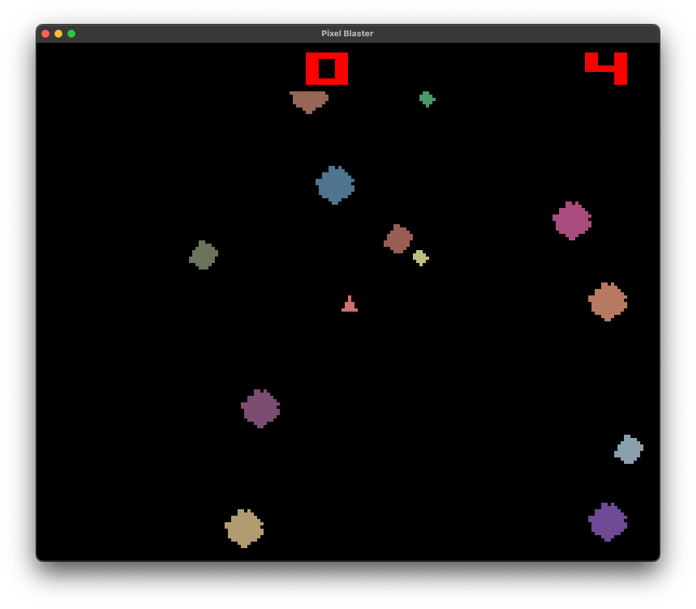

# Pixel Blaster

**Copyright © 2025 Glen Beane**

**Pixel Blaster** is a simple retro-style asteroid blaster game built with Python, PySide6, and Numpy. The game is 
inspired by classic 8-bit console games and aims to provide a nostalgic gaming experience. It is not an exact clone 
but is inspired by the gameplay and aesthetics of Asteroids on the Atari 2600. It has been decades since I played 
that game (by using an emulator in the early 2000s), so this is mostly based on distant memories.

This is a work in progress, and the game is not yet complete. 

## Design

While the game is implemented using PySide6, I make minimal use of the Qt framework. Primarily, I use it for window 
management, keyboard input, and the QTimer-based game loop. The game graphics themselves are implemented using a 
simple frame-buffer approach (yes, I know the Atari 2600 did not have a frame buffer), where colors of individual
pixels are set each iteration of the game loop. The frame buffer is implemented with a Numpy array. Pixels are 
drawn directly to the frame buffer during the game loops update phase, and at the end of the game loop the display
is updated by converting the Numpy array to a QImage and displaying it in a QLabel.

## Keyboard Controls
- **Left Arrow**: Rotate player ship counter-clockwise
- **Right Arrow**: Rotate player ship clockwise
- **Up Arrow**: Apply thrust to player ship
- **Space**: Shoot a projectile from player ship

## Current Features
- Player-controlled spaceship
- Large retro bitmapped font (numbers only) for displaying score and player lives
- Smaller retro bitmapped font (numbers and upper case letters) for displaying text
- Asteroids that move around the screen
- Collision detection between player ship and asteroids
- Player ship can shoot projectile at asteroids either splitting them into smaller asteroids or destroying them
- Score tracking
- Large and medium asteroids break into smaller asteroids when hit
- Basic sound effects
